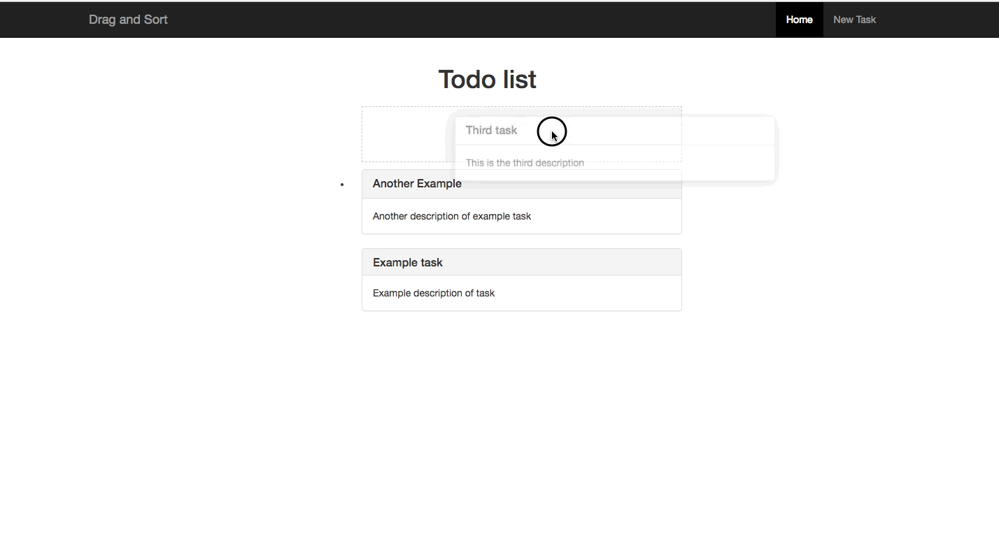

# Draggable Todo
A drag and drop sortable todo list in Rails.

## Demo


## Getting Started

### Prerequisites

* A Ruby Version Manager
* A package manager, like [bundler](http://bundler.io/)

### Installing

* Clone this repo.

```
git clone https://github.com/jacobsteves/Rails-Draggable-Todo.git
```

* Initialize our local repo: 
```
bundle install && rake db:migrate
```

* Start the rails server: 
```
rails s
```

## Versioning

We use [SemVer](http://semver.org/) for versioning. For the versions available, see the [tags on this repository](https://github.com/jacobsteves/Rails-Draggable-Todo/tags).

## License

This project is licensed under the MIT License - see the [LICENSE](LICENSE) file for details
